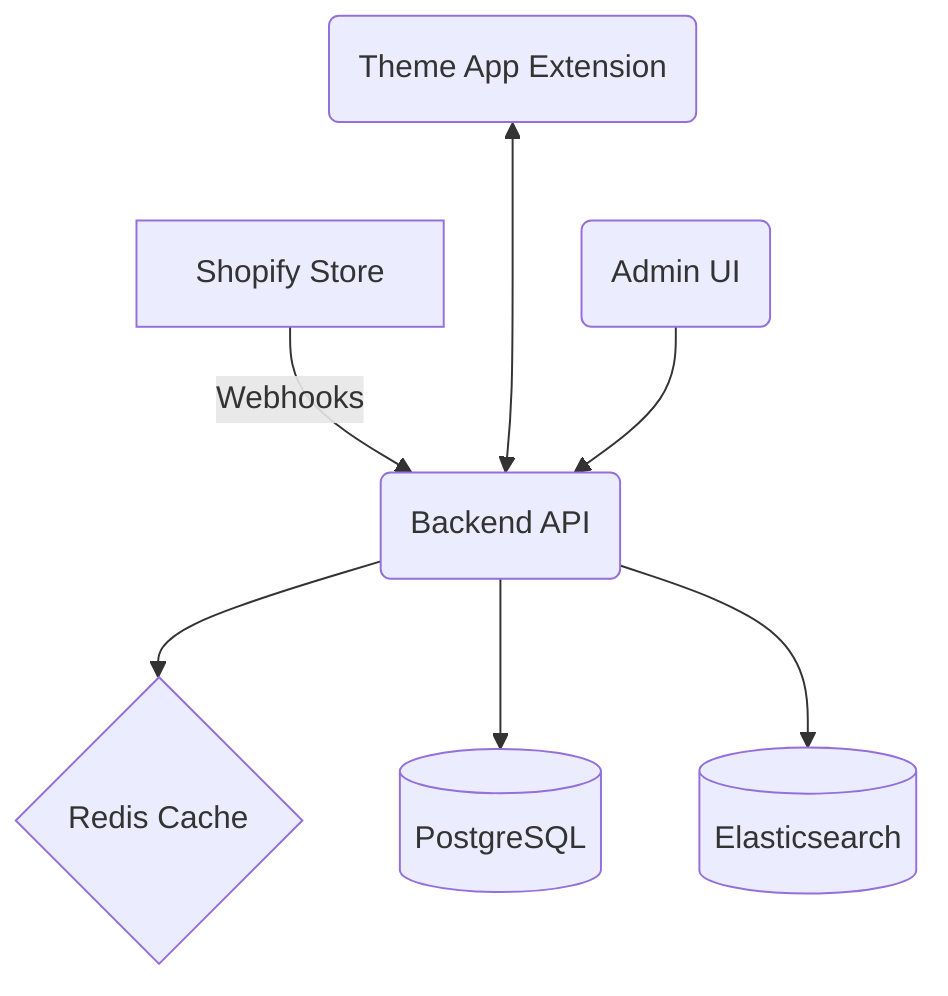

# Phase 1: Planning & Architecture

This phase defines the scope of the Shopify Advanced Search app and records all decisions required before coding begins. Use this document as the single source of truth for features, requirements, and technical direction.

## 1. Feature & Requirement Gathering
1. **Feature Checklist**
   - **Shopify OAuth & Billing** – merchants install the app and approve recurring charges.
   - **Product Indexing** – sync products, variants, collections, and metafields via webhooks.
   - **Search API** – provide fast search with filtering, sorting, and typo tolerance.
   - **Synonym & Stop Word Management** – admin can manage synonyms and stop words through the dashboard.
   - **Analytics** – store query statistics, no‑result terms, and product click tracking.
   - **Admin Dashboard** – configuration UI for weighting, synonyms, and analytics reports.
   - **Theme App Extension** – search bar and results snippets embedded in storefront themes.
   - **Multi‑language Support** – enable multiple locales using Shopify’s i18n framework.
   - **Security & Compliance** – encryption, access control, and privacy requirements.

2. **User Stories**
   - **As a merchant (admin)** I want to install the app, configure search settings, manage synonyms, and view analytics so that I can improve product discovery.
   - **As a merchant** I want to bulk import synonyms via CSV and export them for editing.
   - **As a shopper** I want to search with filters (collections, price, tags) and see results with suggestions quickly.
   - **As a shopper** I want the search bar to autocomplete as I type and handle misspellings gracefully.

3. **Compliance & Policy Requirements**
   - Align with GDPR: provide a privacy policy, allow data export/deletion, and store PII securely.
   - Follow Shopify App Store review guidelines, including billing API usage and proper data handling.
   - Document data retention policy and security contact information.

## 2. High-Level Architecture
1. **Component Diagram**

2. **Data Flow**
   - Shopify webhooks (products, collections, metafields) are verified and queued by the backend.
   - A background worker fetches product data and writes to Elasticsearch in bulk.
   - Storefront search requests go through the Theme App Extension, hit the backend API, and leverage Redis caching before querying Elasticsearch.
   - Admin UI requests authenticate via Shopify OAuth and interact with PostgreSQL for configuration and analytics.

3. **Security Measures**
   - Enforce HTTPS across all endpoints and use HSTS.
   - Verify Shopify webhook signatures and rotate secrets regularly.
   - Store OAuth tokens encrypted at rest (PostgreSQL using pgcrypto or KMS).
   - Limit network access via Kubernetes NetworkPolicies and security groups.

## 3. Technology Decisions
1. Confirm tool versions and key dependencies:
   - Node.js 18+
   - PostgreSQL 15
   - Redis 7
   - Elasticsearch 8
   - React 18 with Shopify Polaris and App Bridge
2. Choose hosting and deployment approach:
   - AWS EKS for Kubernetes workloads with separate namespaces for staging and production.
   - RDS for PostgreSQL with automated backups and encryption at rest.
   - Elastic Cloud for managed Elasticsearch clusters.
   - AWS ElastiCache for managed Redis.
3. CI/CD and Tooling:
   - GitHub Actions for linting, testing, Docker builds, and Helm deployments.
   - Terraform to provision AWS resources and keep infrastructure as code.
   - Helm charts for versioned application releases.
   - ESLint/Prettier and Husky for consistent code style and pre-commit checks.

## 4. Acceptance Criteria & Milestones
1. Success metrics for core functionality:
   - Search response time under 200 ms with caching.
   - Indexing throughput capable of handling stores with 50k products.
   - Admin dashboard loads within 1 second.
2. **Milestones & Timeline**

| Phase | Key Deliverables | Est. Duration |
|------|-----------------|--------------|
| Phase 1 | Finalized plan, architecture diagram, technology stack decisions | 1 week |
| Phase 2 | Terraform, Helm charts, CI/CD setup, local dev environment | 2 weeks |
| Phase 3 | Shopify OAuth, webhooks, theme extension scaffold | 1–2 weeks |
| Phase 4 | Core backend services, indexing pipeline | 3 weeks |
| Phase 5 | Search engine logic (filters, synonyms, boosting) | 3 weeks |
| Phase 6 | React/Polaris admin interface | 2 weeks |
| Phase 7 | Theme extension UI | 2 weeks |
| Phase 8 | Testing & QA | 2 weeks |
| Phase 9 | Deployment & monitoring setup | 1 week |
| Phase 10 | App Store submission & launch | 1 week |

3. Review checkpoints after each phase ensure requirements are met and to make adjustments if timelines shift or new requirements arise.

